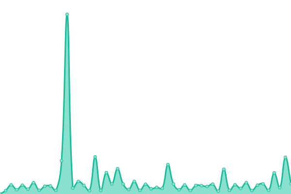

# [📈 Live Status](https://peimando.github.io): <!--live status--> **🟧 Partial outage**

This repository contains the open-source uptime monitor and status page for [peimando](https://peimando.github.io), powered by [Upptime](https://github.com/upptime/upptime).

With [Upptime](https://upptime.js.org), you can get your own unlimited and free uptime monitor and status page, powered entirely by a GitHub repository. We use [Issues](https://github.com/peimando/fimosis_monitor/issues) as incident reports, [Actions](https://github.com/peimando/fimosis_monitor/actions) as uptime monitors, and [Pages](https://peimando.github.io) for the status page.

<!--start: status pages-->
<!-- This summary is generated by Upptime (https://github.com/upptime/upptime) -->
<!-- Do not edit this manually, your changes will be overwritten -->
<!-- prettier-ignore -->
| URL | Status | History | Response Time | Uptime |
| --- | ------ | ------- | ------------- | ------ |
|  [Google](https://www.google.com) | 🟩 Up | [google.yml](https://github.com/peimando/fimosis_monitor/commits/HEAD/history/google.yml) | 

 113ms
     
 | 

<a href="https://peimando.github.io/fimosis_monitor/history/google">100.00%</a>
    

|  [AVIS](https://sscoquimbo.avislatam.com/modulos/login/index.cfm) | 🟩 Up | [avis.yml](https://github.com/peimando/fimosis_monitor/commits/HEAD/history/avis.yml) | 

 576ms
     
 | 

<a href="https://peimando.github.io/fimosis_monitor/history/avis">100.00%</a>
    

|  [AVIS C](https://csscoquimbo.avislatam.com/modulos/login/index.cfm) | 🟩 Up | [avis-c.yml](https://github.com/peimando/fimosis_monitor/commits/HEAD/history/avis-c.yml) | 

 571ms
     
 | 

<a href="https://peimando.github.io/fimosis_monitor/history/avis-c">100.00%</a>
    

|  [API MERCADO PUBLICO](https://api.mercadopublico.cl/servicios/v1/publico/ordenesdecompra.json?fecha=30122022&CodigoOrganismo=7312&ticket=E1951384-BF88-4EE5-8C33-934680281626) | 🟩 Up | [api-mercado-publico.yml](https://github.com/peimando/fimosis_monitor/commits/HEAD/history/api-mercado-publico.yml) | 

 11074ms
     
 | 

<a href="https://peimando.github.io/fimosis_monitor/history/api-mercado-publico">96.22%</a>
    

|  [Earendel](https://peimando.github.io/) | 🟩 Up | [earendel.yml](https://github.com/peimando/fimosis_monitor/commits/HEAD/history/earendel.yml) | 

 162ms
     
 | 

<a href="https://peimando.github.io/fimosis_monitor/history/earendel">100.00%</a>
    

|  [Test Broken Site](https://thissitedoesnotexist.koj.co) | 🟥 Down | [test-broken-site.yml](https://github.com/peimando/fimosis_monitor/commits/HEAD/history/test-broken-site.yml) | 

 0ms
     
 | 

<a href="https://peimando.github.io/fimosis_monitor/history/test-broken-site">100.00%</a>
    

<!--end: status pages-->

[**Visit our status website →**](https://peimando.github.io/fimosis_monitor)

## 📄 License

- Powered by: [Upptime](https://github.com/upptime/upptime)
- Code: [MIT](./LICENSE) © [peimando](https://peimando.github.io)
- Data in the `./history` directory: [Open Database License](https://opendatacommons.org/licenses/odbl/1-0/)
